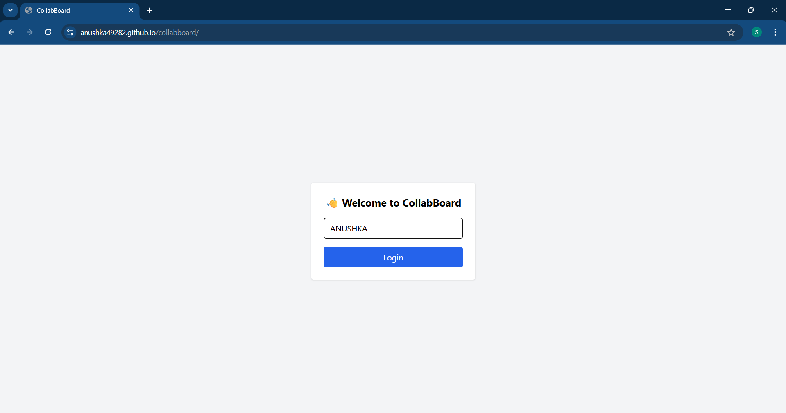
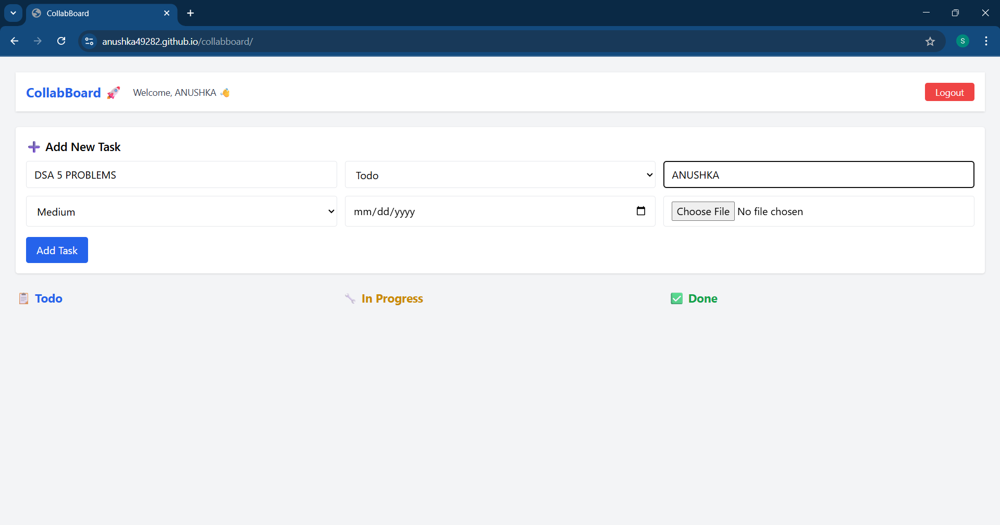
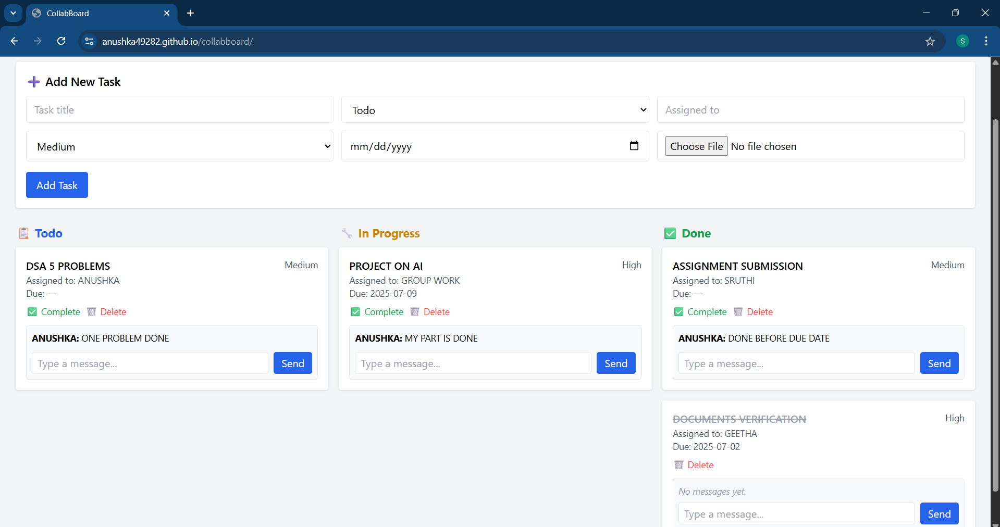

# 🚀 CollabBoard

**CollabBoard** is a collaborative task management app built with React, Node.js, and Socket.IO. It allows teams to add, manage, and discuss tasks in real time — complete with priority tags, due dates, file attachments, and live chat.

---

## 🌐 Live Demo

🌍 [Click here to view](https://anushka49282.github.io/collabboard)

---

## 🖼️ UI Preview

Here’s a quick look at the CollabBoard interface:

### 🔐 Login Page  


### 📋 Task Dashboard  


### 💬 Task Chat Feature  


---

## 🛠️ Features

- ✅ Create, edit, and delete tasks
- 🔁 Real-time task updates using Socket.IO
- 🗂️ Task assignment to team members
- 🏷️ Priority tags (High, Medium, Low)
- 📅 Due date picker for deadlines
- 📎 File attachment support
- 💬 Real-time task-based chat
- 🔒 Simple login/logout (local storage)
- 🎨 Built with Tailwind CSS

---

## 📁 Project Structure

```
collabboard/
├── build/                # Production-ready frontend
├── public/               # Static public files
├── src/                  # React frontend code
├── uploads/              # Uploaded files
├── server.js             # Express backend + Socket.IO
├── tailwind.config.js    # Tailwind setup
├── package.json
└── README.md
```

---

## 🚀 Deployment

### Frontend (GitHub Pages)

```bash
npm run build
npm run deploy
```

> Ensure `homepage` and deploy scripts are correctly set in `package.json`.

### Backend (Optional)

Use services like **Render**, **Railway**, or **Vercel Functions** to deploy `server.js`.

---

## 🔧 Setup Instructions

### 1. Clone the repository

```bash
git clone https://github.com/ANUSHKA49282/collabboard.git
cd collabboard
```

### 2. Install dependencies

```bash
npm install
```

### 3. Start the backend server

```bash
node server.js
```

### 4. Start the React frontend

```bash
npm start
```

---

## 👩‍💻 Author

**Anushka Sunke**  
📧 [sunkeanushka@gmail.com](mailto:sunkeanushka@gmail.com)  
🌐 [LinkedIn](https://www.linkedin.com/in/sunkeanushka248/)  

---

## 📜 License

This project is licensed under the MIT License.
